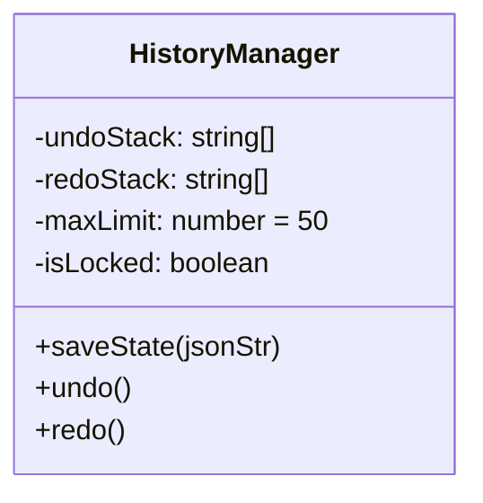

# 歷史紀錄管理模組規格書 (v0)

## 1. 實體架構圖


## 2. 資料結構定義
```typescript
interface IHistoryState {
    canvasJSON: string; // 整個畫布的序列化字串
    timestamp: number;
}
```

## 3. 詳細演算法與生命週期
- **狀態攔截寫入**：
  1. 監聽 `CANVAS:OBJECT_MODIFIED`、`ADDED`、`REMOVED` 事件。
  2. 將目前的 `redoStack` 清空（一旦產生新動作，未來的重做即失效）。
  3. 呼叫 `CanvasEngine.toJSON()` 取得字串，推入 `undoStack`。
  4. 若 `undoStack.length > maxLimit`，則 `undoStack.shift()` 移除最舊的一筆。
- **復原執行 (Undo)**：
  1. 從 `undoStack` pop 出最新一筆狀態。
  2. 將該狀態 push 到 `redoStack`。
  3. 設定 `isLocked = true` (防止 `loadFromJSON` 觸發無限迴圈寫入)。
  4. 呼叫 `CanvasEngine.loadFromJSON()`，完成後設定 `isLocked = false`。
  
## 4. 單元測試案例清單
1. `test_undo_stack_limit`: 斷言連續觸發 55 次存檔後，`undoStack.length` 是否嚴格等於 50。
2. `test_redo_stack_cleared_on_new_action`: 斷言在 Undo 兩次後，若發動新操作，`redoStack` 是否會被清空長度為 0。
3. `test_selection_events_ignored`: 斷言單純的點擊選取事件不會增加 `undoStack` 的長度。
