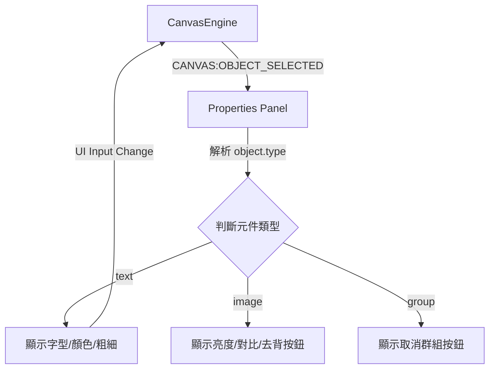

# 屬性面板模組規格書 (v0)

## 1. 實體架構圖


## 2. 資料結構定義
```typescript
interface IObjectProperties {
    type: 'text' | 'image' | 'rect' | 'group';
    left: number;
    top: number;
    scaleX: number;
    scaleY: number;
    fill?: string;
    opacity?: number;
    text?: string;
    fontFamily?: string;
}
```

## 3. 詳細演算法與生命週期
- **資料綁定**：
  - 當畫布選取物件變更時，擷取該物件的屬性映射到 `IObjectProperties` 介面。
  - 依據 `type` 切換面板渲染的 DOM 區塊 (例如隱藏圖片專屬濾鏡，顯示文字調整區)。
- **即時更新 (Two-way Binding)**：
  - 面板上的 Slider 或 Color Picker 在拖曳時 (input event)，即時觸發 `EventBus.emit('UI:PROPERTY_CHANGED', { key: 'fill', value: '#fff' })`。
  - `CanvasEngine` 監聽此事件，呼叫 `activeObject.set({ fill: '#fff' })` 並 `canvas.requestRenderAll()`。

## 4. 單元測試案例清單
1. `test_properties_panel_empty_state`: 斷言當收到 `CANVAS:SELECTION_CLEARED` 時，面板會顯示空狀態提示文字。
2. `test_multi_selection_hides_properties`: 斷言 Shift 多選時 (`type === 'activeSelection'`)，面板僅顯示群組操作，隱藏顏色/字型修改。
