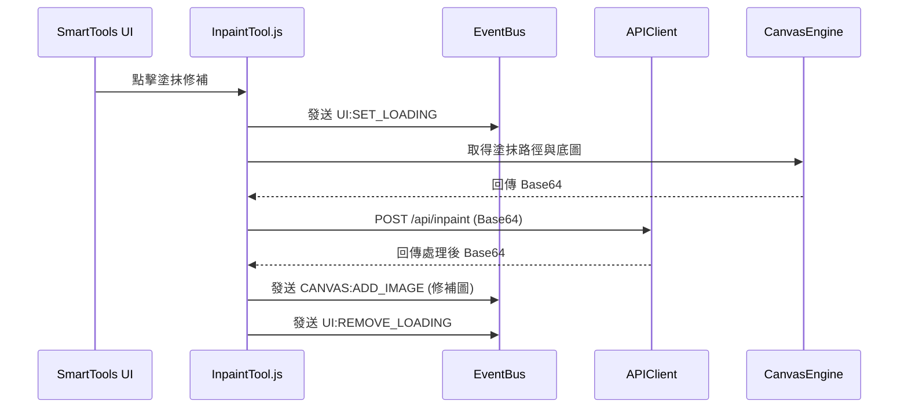

# 智慧工具模組規格書 (v0)

## 1. 實體架構圖


## 2. 資料結構定義
```typescript
interface IInpaintRequest {
    originalImageBase64: string;
    maskBase64: string; // 塗抹或選框範圍
    brushSize?: number;
}
```

## 3. 詳細演算法與生命週期
- **前置檢查**：模組載入時，訂閱 `WORKSPACE:FILE_STATUS`，若 `hasFile === false`，則 UI 按鈕綁定 `disabled` 屬性。
- **選框擷取演算法**：
  1. 使用者拖曳產生 `Rect` (選框)。
  2. 計算該 `Rect` 相對於底圖背景的絕對座標。
  3. 利用隱藏的 HTML5 Canvas，將原圖該區塊使用 `ctx.drawImage` 裁切出來轉為 base64 送出 API。
- **錯誤降級**：API 拋出 500 時，透過 EventBus 觸發 `UI:SHOW_TOAST('修補失敗，請重試')`。

## 4. 單元測試案例清單
1. `test_smart_tools_disabled_before_import`: 斷言未匯入檔案時，呼叫任何工具函式皆回傳 `false`。
2. `test_inpaint_api_timeout_fallback`: Mock API 延遲 16 秒，斷言系統是否正確解除 Loading 並顯示 Toast。
3. `test_mask_canvas_crop_coordinates`: 測試畫布縮放比例為 75% 時，選框去背擷取的圖層座標是否能正確映射回原始 100% 座標。
