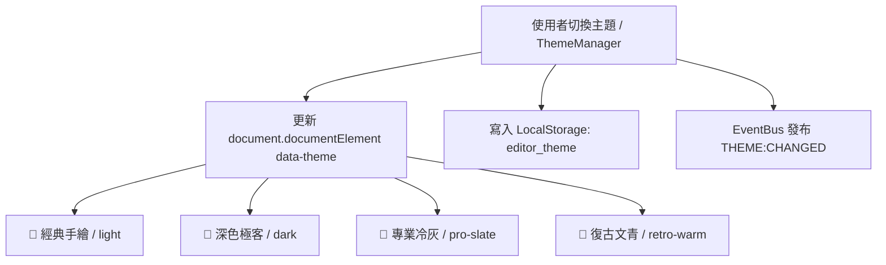

# 🎨 多媒體畫布編輯器 V2 - 全系統風格指令總綱 (Themes Master Directive)

## 1. 模組架構與切換機制

本系統採用 **CSS Scope 與 Data-Attribute 動態切換架構**：

---

## 2. 4 大風格調性與設計指標對照

| 風格名稱 | 主題識別碼 | 主色調 | 邊框特性 | 陰影特性 | 字體風格 | 核心調性 |
| :--- | :--- | :--- | :--- | :--- | :--- | :--- |
| **🎨 經典手繪** | `light` | 亮黃、靛藍、純白 | 2.5px 粗黑手繪邊框 | 立體硬陰影 (2px 2px) | 無襯線 (Sans-serif) | 活潑、塗鴉、手感 |
| **🌙 深色極客** | `dark` | 曜石黑、電光青、霓虹藍 | 1px~1.5px 霓虹微發光邊框 | 0 0 16px 霓虹光暈 | 等寬 (Monospace) + Sans | 科技、專注、夜間模式 |
| **💼 專業冷灰** | `pro-slate` | 冷灰、深石墨、純白 | 1px 細微冷灰邊框 | 柔和自然擴散陰影 | 現代幾何 (Inter/System) | 精密、SaaS、生產力 |
| **📜 復古文青** | `retro-warm` | 羊皮紙、深胡桃木、焦糖金 | 1.5px 皮革棕雙線手帳邊框 | 2px 2px 手帳壓印陰影 | 典雅襯線 (Serif) | 溫潤、人文、手帳出版 |

---

## 3. 子模組風格指令索引

1. [🌙 深色極客風格指令](file:///C:/EditorV2/src/themes/dark-geek/風格指令.md)
2. [💼 專業冷灰風格指令](file:///C:/EditorV2/src/themes/pro-slate/風格指令.md)
3. [📜 復古文青風格指令](file:///C:/EditorV2/src/themes/retro-warm/風格指令.md)
4. [⚙️ 系統設定彈窗風格指令](file:///C:/EditorV2/src/themes/settings-modal/風格指令.md)
5. [🎭 身分認證與登入彈窗風格指令](file:///C:/EditorV2/src/themes/auth-modal/風格指令.md)

---

## 4. 新增元件或主題擴充 SOP
1. **基礎 HTML**：採用語意化標籤與共用 class（如 `sketch-panel`, `sketch-btn`）。
2. **主題覆寫**：在各主題專屬 CSS 中（如 `dark-geek.css`, `pro-slate.css`）使用 `[data-theme="..."] .component-class` 進行覆寫。
3. **無重繪更新**：必須確保切換主題時 DOM 結構不被破壞，僅透過 CSS 屬性與 class 動態重繪。
